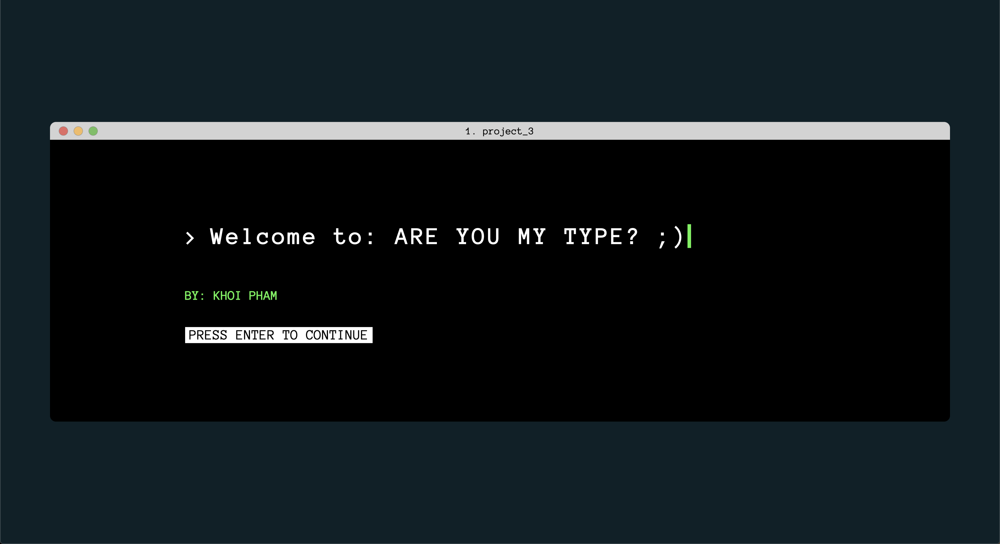
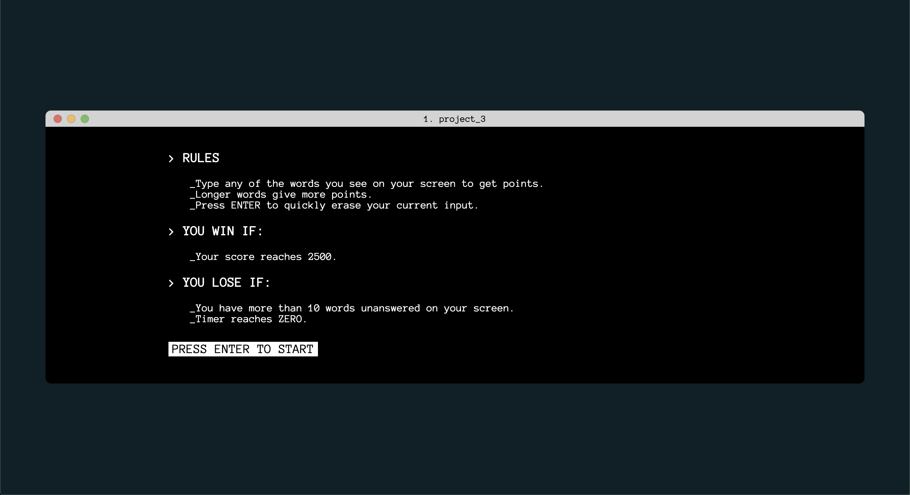
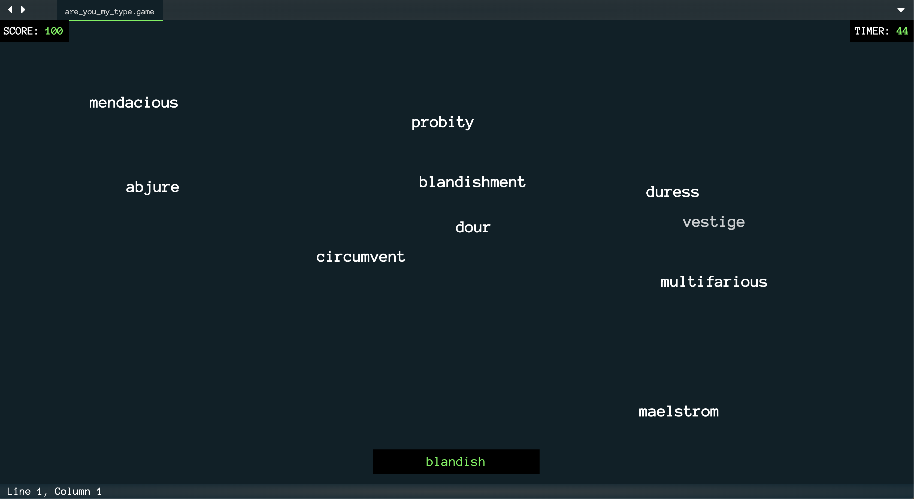

# Are You My Type?
*Are You My Type?* is a light-hearted programming-themed typing game!

Difficult randomly appear on the screen and users must type them out as fast as they can. Stats of the user's performance are available upon winning.

Notable features include word collision detection, word death animations and overall theme design.

## Live Link
[Link to game](http://khoipham.net/are-you-my-type/)

## Screenshots

